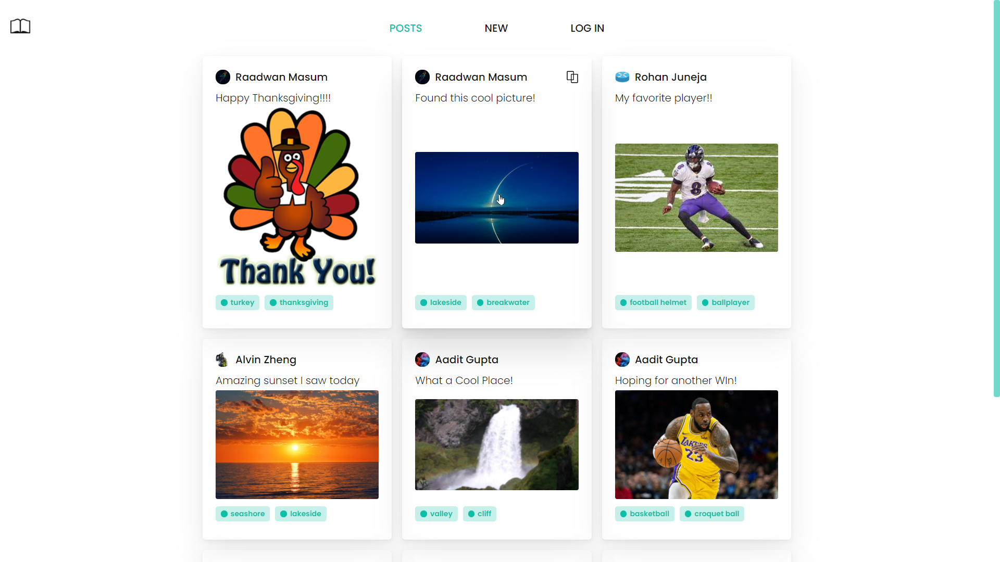

    

    <i>Pass on your memories through the web</i>
    

## 🎨 Features

Webshare is a a web app built for sharing experiences through images. It features:

-   AI Image Classification
-   Post Tagging & Filtering
-	Secure Google OAuth 2.0 Authenticaton

## ✨ In Action

## 👨‍💻 Authors

-   [Raadwan Masum](https://raadwan.com)
-   [Safin Singh](https://safin.dev)
-   [Rohan Juneja](https://rohanj.dev)
-   [Aadit Gupta](https://aaditgupta.tech)
- 	[Alvin Zheng](https://www.linkedin.com/in/alvin-zheng-q/)
